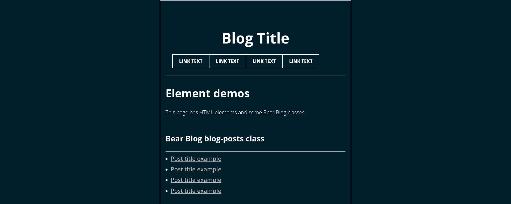
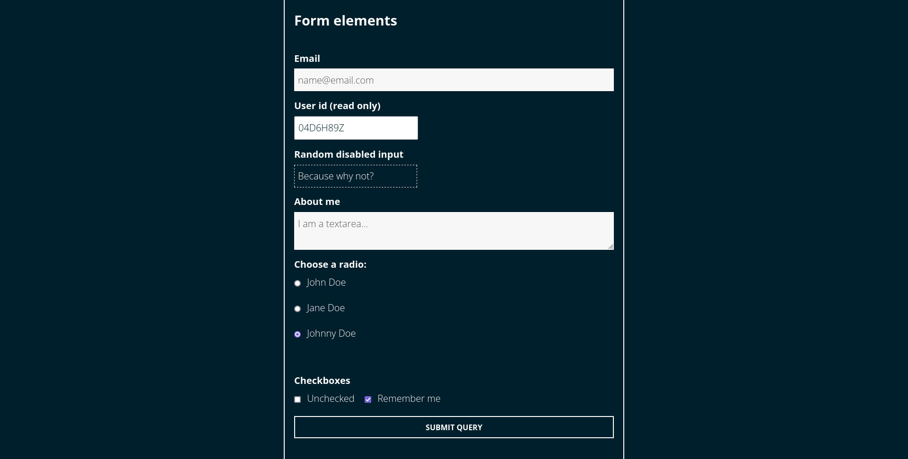
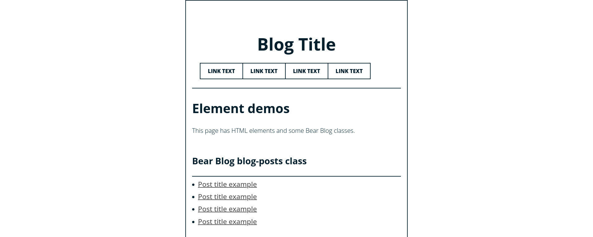
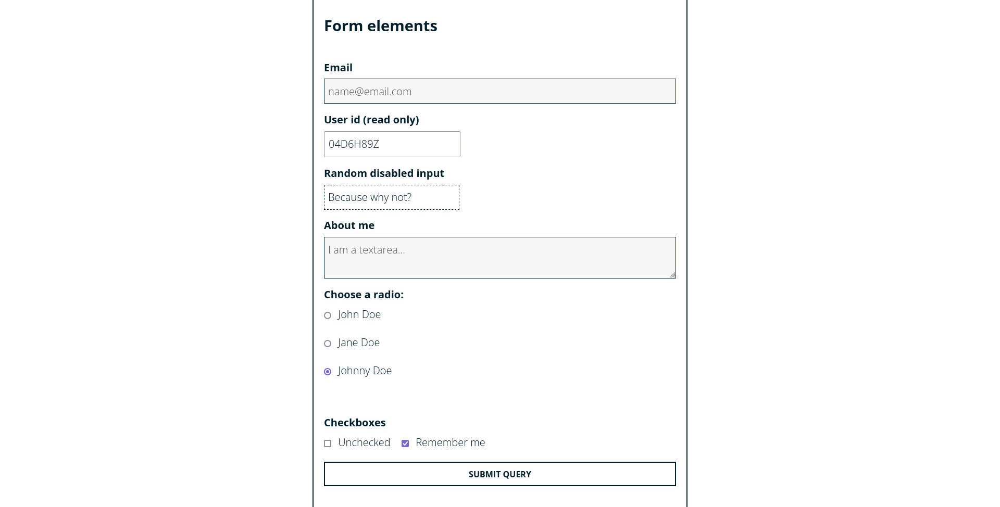

# Cyanotype Bear Blog Theme

This open source theme is a modified version of the Cyanotype Wordpress theme compatible with the blogging platform Bear Blog which uses minimal CSS classes. It is not an aesthetic clone, it looks like other no-class CSS themes. 

Accessibility considerations were made when developing this theme.

This document is to explain the purpose of the theme and how the classes and CSS selectors work.

The theme is in alpha.

## Contents
1. [About](#about)
   1. [Screenshots](#screenshots)
   2. [Features](#features)
   3. [Limitations](#limitations)
   4. [License](#license)
2. [Background](#background)
   1. [Development](#development)
   2. [About Cyanotype](#about-cyanotype)
   3. [About Bear Blog](#about-bear-blog)
   4. [About Classless CSS](#about-classless-css)
3. [For Developers](#for-developers)
   1. [Requirements](#requirements)
   2. [CSS Classes](#css-classes)
4. [For Contributors](#for-contributors)

## About

### Screenshots

For details about the contents of the below screenshots, you can view the [HTML file](./element-demo.html) or the [plain text version](./element-demo.txt) of the HTML content without HTML markup.

#### Dark mode

Like Cyanotype the navigation menu items are in boxes which will invert upon hover or focus. The colour is a dark blue background with white foreground.

Email and textarea fields span the width of the main content area. Radio buttons and checkboxes have tap areas at least 44px high.

A full size screenshot with more elements is available at [Dark (fullsize)](./img/dark-fullsize.jpg).

#### Light mode

The light mode colours are inverted.

The elements that aren't inverted include the form elements and input fields.

A full size screenshot with more elements is available at [Light (full size)](./img/light-fullsize.jpg). 

### Features

- Verdana font
- Large font
- Large buttons (min 44px height)
- Large inputs (min 44px height)
- High contrast text (including placeholders)
- Visible dotted outline on disabled text inputs
- Light and dark mode
- Skip link support
- Compatible with static site generators

### Limitations

- Removal of Cyanotype Wordpress custom classes (e.g. support for calendars)
- Bear Blog does not support the insertion of skip links (but other site generators do)

### License

This theme is open source and licensed under a [GNU General Public License (V3)](https://www.gnu.org/licenses/gpl-3.0.html). 

## Background

### Development

This theme was developed for a client project. The client wanted to move from Wordpress to a static site generator (either Bear Blog, Eleventy, or something else), and wanted a copy of Cyanotype to use on their new blog which would be compatible with those systems. 

The Bear Blog CSS was simple enough that it would be more interoperable with static site generators and the Cyanotype theme could feasibly be converted into a minimal CSS theme.

The client requested some changes to the fonts, font sizes, and a light and dark mode, resulting in the Cyanotype Bear Blog theme.

### About Cyanotype

[Cyanotype](https://wordpress.com/theme/cyanotype) is a Wordpress theme by Automatic. It is <q>a monochromatic blog theme with a bold, yet simple look that sets your blog apart from the rest. Pick your favorite Background Color or Image to lend your personal flair.</q>

#### Resources

- [Cyanotype (Wordpress Theme)](https://wordpress.com/theme/cyanotype)
- [cyanotype.zip Download](https://public-api.wordpress.com/rest/v1/themes/download/cyanotype.zip)
- [GPLv2 License](http://www.gnu.org/licenses/gpl-2.0.html)

### About Bear Blog

Bear Blog is a blogging platform which aims to <q>shun the bloat of the modern web, embrace the bear necessities.</q>

From the [Bear Blog homepage](https://bearblog.dev/):

<blockquote>A privacy-first, no-nonsense, super-fast blogging platform
No trackers, no javascript, no stylesheets. Just your words.</blockquote>

Despite Bear Blog's claim that there are no <q>no stylesheets</q>, stylesheets can be inserted between `<style>` tags in the `<head>` of the HTML using the Style subheading in the Dashboard. Bear Blog uses some classes and has some themes available.

#### Resources

- [Bear Blog homepage](https://bearblog.dev/)
- [Bear Docs](https://docs.bearblog.dev/)
- [Styling (Bear Docs)](https://docs.bearblog.dev/styling/)

### About Classless CSS

Classless CSS Themes are lightweight and can be used as a starting point for a Bear Blog theme. CSS Bed has many examples.

#### Resources

- [CSS Bed](https://www.cssbed.com/)

## For Developers

### Requirements

Although the Cyanotype Bear Blog theme was made to be compatible with Bear Blog, the classes are simple enough that it can be used with other site generators like Eleventy.

Your website development system needs to support:

- CSS style sheets
- editable HTML (to add classes)

### CSS Classes

You should hierarchically organise HTML elements so the theme appears correctly when CSS selectors are applied.

We will move from the top of the page to the bottom.

#### Body elements

The `<body>` element can have one of the following Bear Blog classes:

- `home` for the homepage
- `post` for blog posts
- `page` for any page (though leaving the body without a class works too)

Other Bear Blog classes for the `<body>` element like `not-found` and `subscribe` will not change the way the page looks. They have been removed.

`post` will change the way `<time>` and `<blockquote>` looks compared to the `home`.

#### Skip link

The first element after `<body>` should be the skip link: `<a href="#main">skip to content</a>` as the CSS is expecting `body a:first-child`. It will remain invisible unless brought into `focus`.

To make the skip link work, add `id="main"` to the `<main>` element.

#### Header

The `<header>` element encloses the blog title and the navigation.

##### Blog title

The wrapping `<a>` should have the `title` tag.

The `h1` tags will enlarge the blog title.

`
    <a class="title" href="/">
      <h1>
        Blog Title
      </h1>
    </a>
`

##### Navigation

The navigation links should be enclosed in an unordered list and wrapped in anchor tags.

`
    <nav>
      <ul>
	  <li><a href='#'>Text</a></li>
	  <li><a href='#'>Text</a></li> 
	  <li><a href='#'>Text</a></li>
	  </ul>
	</nav>
`
	
#### Main

The `<main>` element should have `id="main"` if you plan to use the skip link (recommended).

##### Forms

The selectors for checkboxes and radioboxes requires their input and label elements are enclosed in div elements.

###### Checkboxes

From `element-demo.html`:

`      

        <input type='checkbox' name='unchecked' id='unchecked'>
        <label for='unchecked'>Unchecked</label>
        <input type='checkbox' name='remember' id='remember' checked>
        <label for='remember'>Remember me</label>
`

The order is `
` then `<input type="checkbox">` then `<label>`, then `
`.

###### Radio

From `element-demo.html`:

`
      <label>Choose a radio:</label>
      

        <input type='radio' id='john' name='drone' value='john' checked>
        <label for='john'>John Doe</label>
     

`

The order is `<label>` then `
` then `<input type="radio">` then `<label>`, then `
`.

##### Other

Bear Blog classes supported for use inside the `<main>` area include:

- `blog-posts` on `<ul>` for a list of blog posts
- `highlight` and `code` classes for codeblocks and highlights

#### Footer

The `<footer>` tag should be outside and not inside the `<main>` element. Links `<a>` are styled differently in the footer.

The footer currently supports a copyright statement.

## For Contributors

Any feedback should be posted in the Codeberg Issues section or emailed to Travis Jeans (hello@scopefilter.net).
